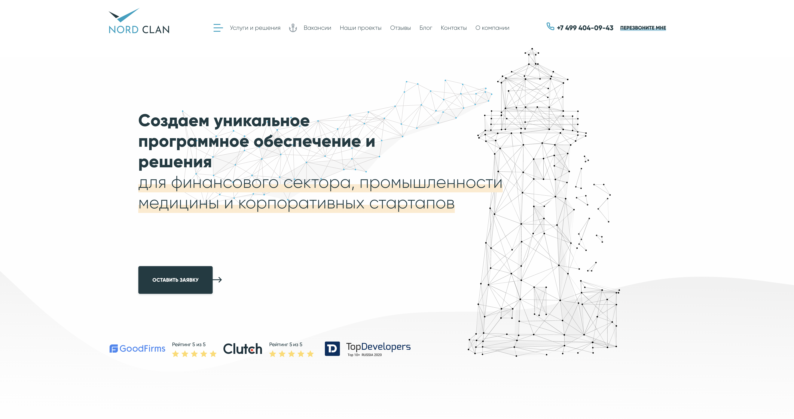
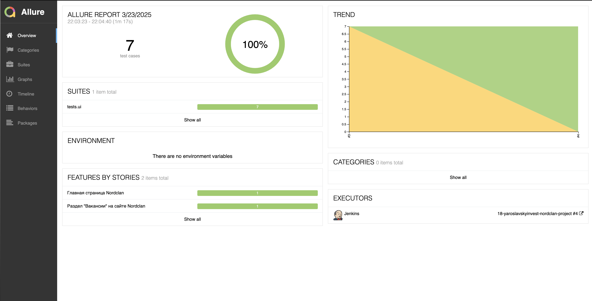
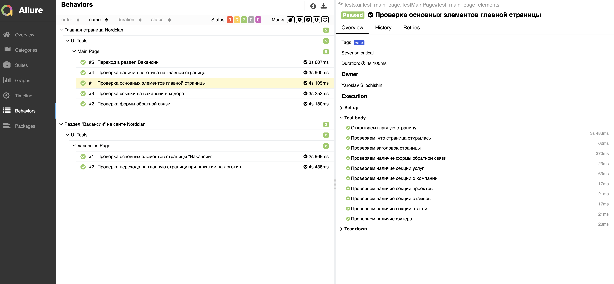
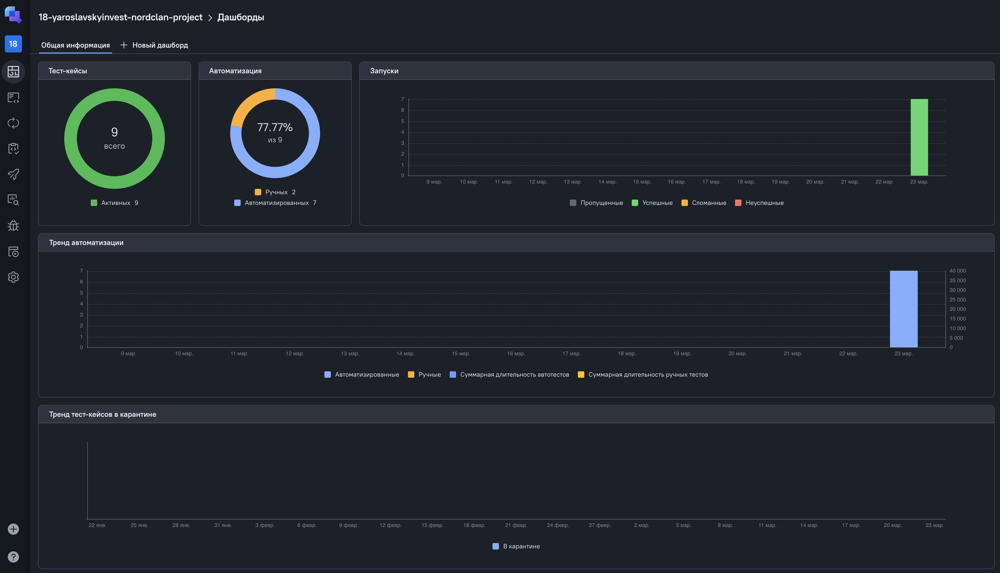
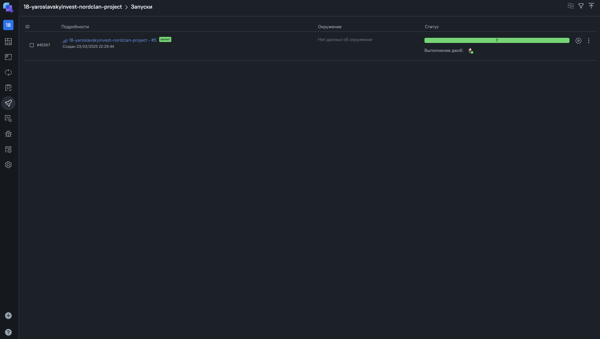
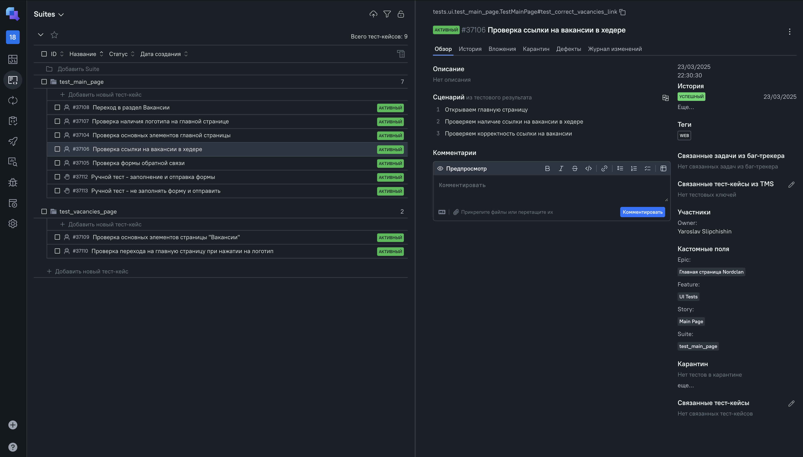
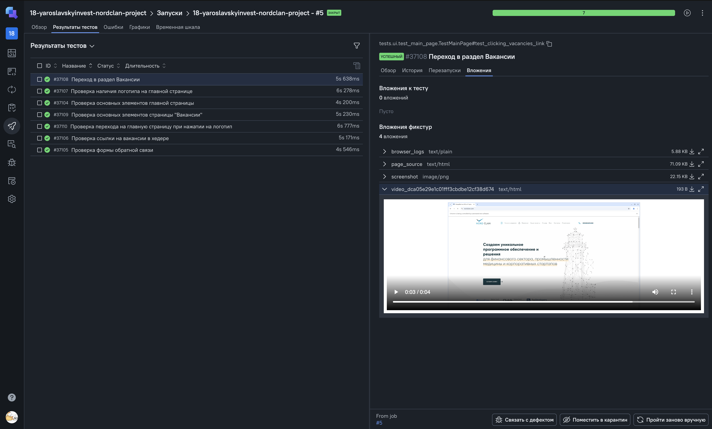
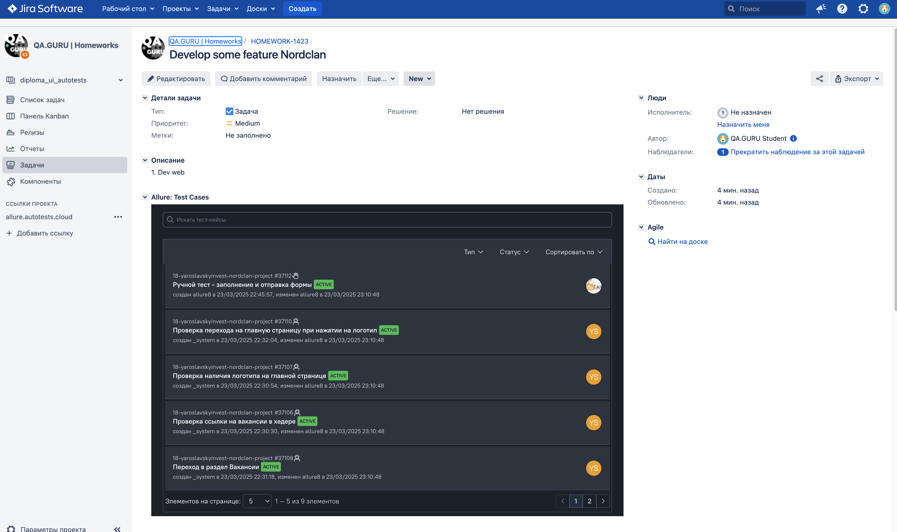
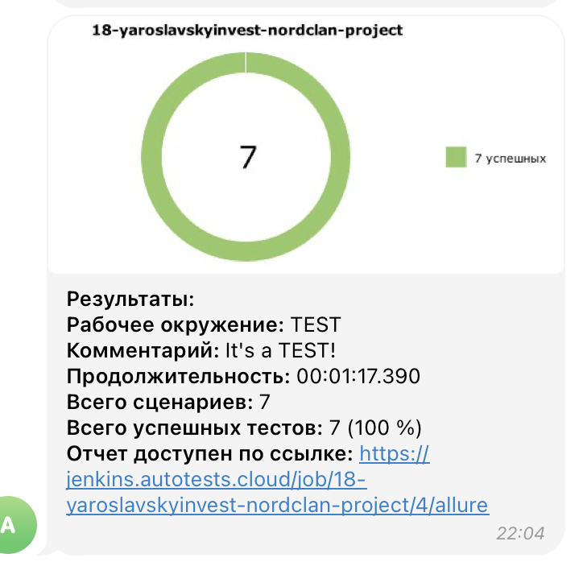
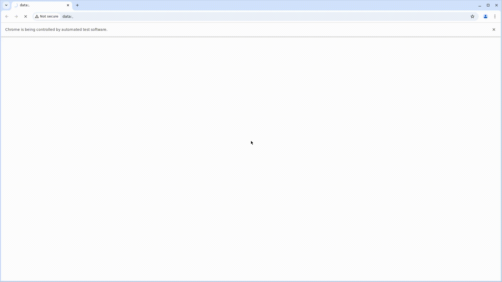

# Nordclan Test Automation Framework


## Описание
Автоматизированный фреймворк для тестирования веб-сайта Nordclan. Фреймворк построен на Python с использованием современных инструментов и практик тестирования.

> [Ссылка на сайт Nordclan](https://nordclan.com)
 


---

## Проект реализован с использованием:
        

- Язык: `Python`
- Для написания UI-тестов используется фреймворк `Selene`, "обёртка" вокруг `Selenium WebDriver`
- Библиотека модульного тестирования: `PyTest`
- `Jenkins` выполняет удаленный запуск тестов.
- `Selenoid` запускает браузер с тестами в контейнерах `Docker` (и записывает видео)
- Фреймворк`Allure Report` собирает графический отчет о прохождении тестов
- После завершения тестов `Telegram Bot` отправляет в `Telegram` краткий вариант отчёта
- Полная статистика по прохождению тестов хранится в `Allure TestOps`
- Настроена интеграция `Allure TestOps` с `Jira`

---

## Структура проекта
```
nordclan_test/
├── pages/                    # Page Objects
│   ├── __init__.py
│   ├── main_page.py         # Главная страница
│   └── vacancies_page.py    # Страница вакансий
├── tests/                   # Тесты
│   ├── __init__.py
│   ├── conftest.py         # Конфигурация pytest
│   └── ui/                 # UI тесты
│       ├── __init__.py
│       └── test_main_page.py
├── utils/                  # Утилиты
│   ├── __init__.py
│   └── attach.py          # Функции для Allure
├── .env                   # Переменные окружения
├── requirements.txt        # Зависимости проекта
└── pytest.ini            # Конфигурация pytest
```

---

## Установка

1. Клонируйте репозиторий:
```bash
git clone https://github.com/YarikSec/nordclan-test.git
cd nordclan-test
```
2. Создайте и активируйте виртуальное окружение:
```bash
python -m venv venv
source venv/bin/activate  # для Linux/Mac
```

3. Установите зависимости:
```bash
pip install -r requirements.txt
```

4. Создайте файл `.env` и добавьте необходимые переменные окружения:
```env
LOGIN=user1
PASSWORD=1234
BASE_URL=https://nordclan.com
```

## Запуск тестов

### Запуск всех тестов
```bash
pytest
```

### Запуск конкретного теста
```bash
pytest tests/ui/test_main_page.py::TestMainPage::test_main_page_elements -v
```

### Запуск тестов с генерацией Allure отчета
```bash
pytest --alluredir=./allure-results
allure serve ./allure-results
```

### Параллельный запуск тестов
```bash
pytest -n 2 # Запустит два теста параллельно
```

## Тест-кейсы

### Главная страница
- [x] Проверка основных элементов страницы
- [x] Проверка формы обратной связи
- [x] Проверка ссылки на вакансии
- [x] Проверка логотипа
- [x] Проверка навигации по логотипу

### Страница вакансий
- [x] Проверка основных элементов страницы
- [ ] Проверка фильтрации вакансий
- [ ] Проверка поиска вакансий
- [ ] Проверка пагинации

## Особенности фреймворка

### Page Object Pattern
- Использование паттерна Page Object для инкапсуляции селекторов и действий
- Методы для проверки видимости элементов
- Методы для взаимодействия с элементами (click, send_keys, open)

### Allure Reporting
- Подробные шаги тестов
- Скриншоты при падении тестов
- Логи браузера
- HTML-снапшоты страниц
- Видео выполнения тестов

### Конфигурация
- Поддержка разных окружений через переменные окружения
- Настройка браузера через Selenoid
- Возможность запуска в headless режиме

## Разработка

### Добавление нового теста
1. Создайте Page Object для новой страницы в директории `pages/`
2. Добавьте селекторы и методы в Page Object
3. Создайте тест в директории `tests/ui/`
4. Используйте фикстуры из `conftest.py`


### Автор
[YarikSec](https://github.com/YarikSec)

----
### Удаленный запуск автотестов выполняется на сервере Jenkins
> [Ссылка на проект в Jenkins](https://jenkins.autotests.cloud/18-yaroslavskyinvest-nordclan-project/)

#### Параметры сборки

- `BROWSER_VERSION` - версия браузера (браузер `Chrome`)
- `COMMENT` - комментарий


#### Для запуска автотестов в Jenkins

1. Открыть [проект](https://jenkins.autotests.cloud/18-yaroslavskyinvest-nordclan-project/)
2. Выбрать пункт `Build with Parameters`
3. Указать версию браузера
4. Указать комментарий
5. Нажать кнопку `Build`
6. Результат запуска сборки можно посмотреть в отчёте Allure

----
### Allure отчет


#### Общие результаты

#### Список тест кейсов и пример отчета о прохождении теста


----
### Полная статистика хранится в Allure TestOps
> [Ссылка на проект в AllureTestOps](https://allure.autotests.cloud/project/4670/dashboards)

#### Дашборд с общими показателями тестовых прогонов



#### История запуска тестовых наборов



#### Тест кейсы



#### Тестовые артефакты



----

### Интеграция с Jira

> [Ссылка на проект в Jira](https://jira.autotests.cloud/browse/HOMEWORK-1421)



----
### Оповещение о результатах прогона тестов в Telegram
> [Ссылка на канал в Telegram](https://t.me/litres_autotest)



----
### Пример видео прохождения ui-автотеста
